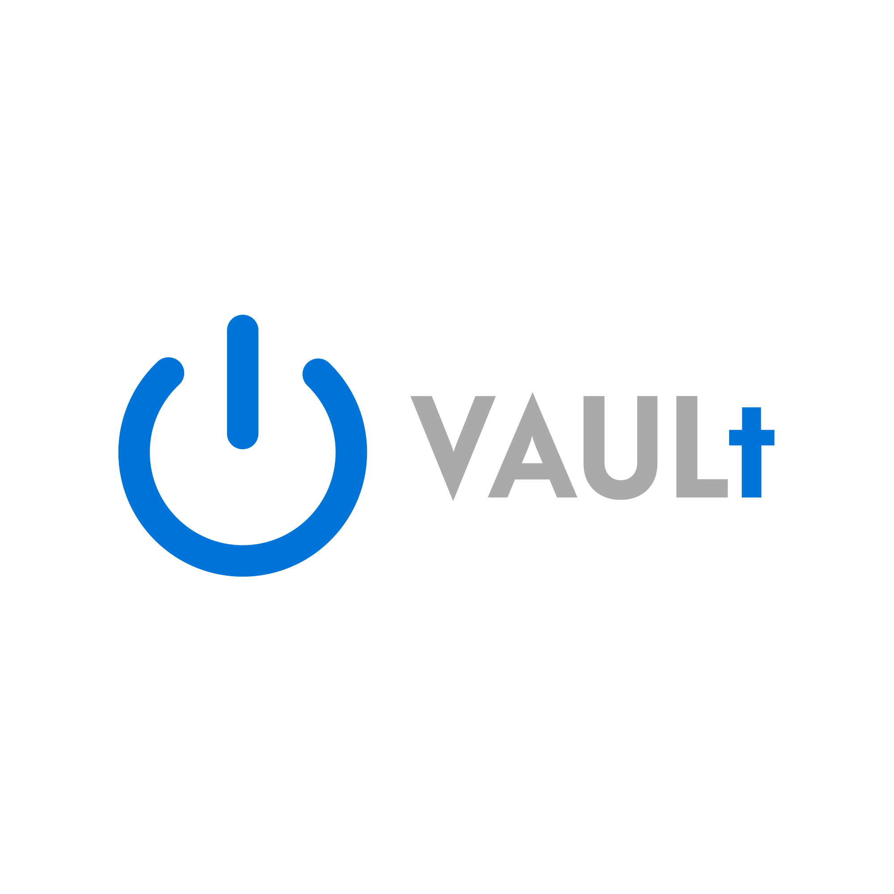
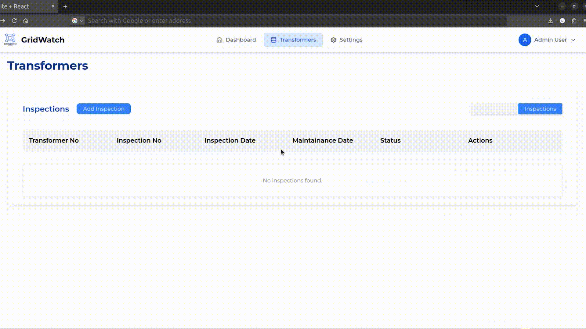
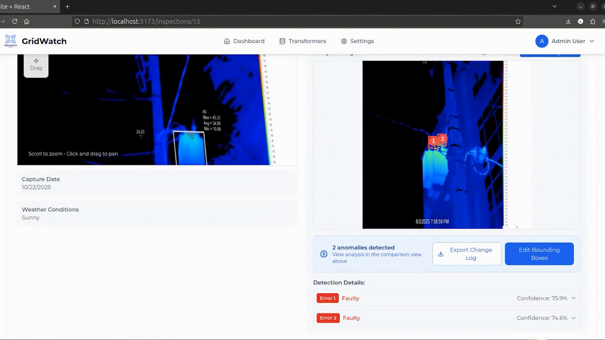
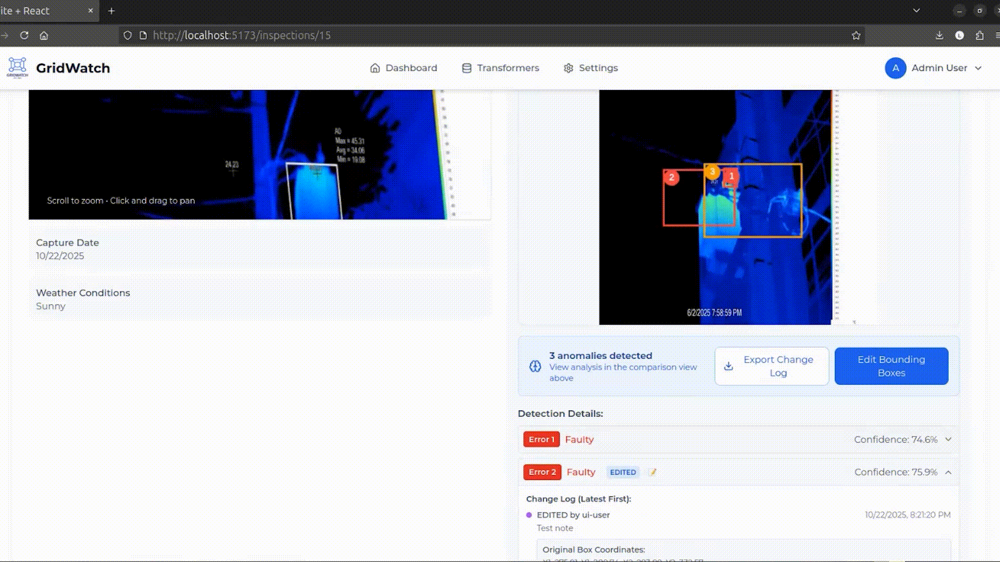
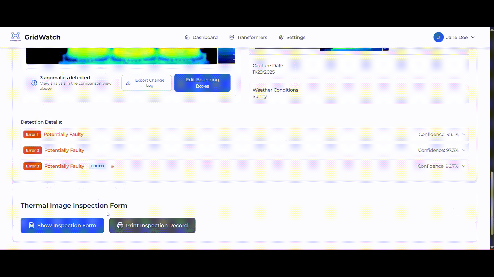
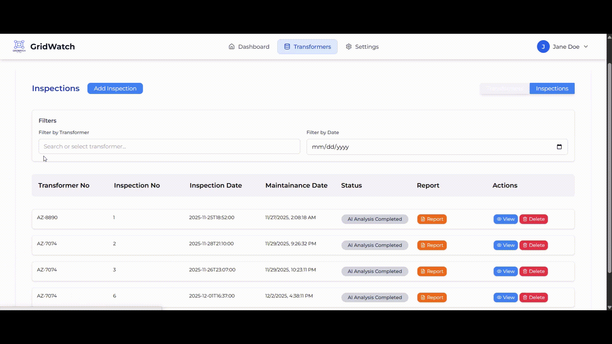

# Project GridWatch by VAULt 🤖⚡

<p align="center">
  
  &nbsp;&nbsp;&nbsp; <!-- optional spacing -->
  
</p>

This repository contains the source code for **Project VAULt**, developed by **Team VAULt** from the **Department of Electronic & Telecommunication Engineering (EN)** at the **University of Moratuwa**, for the **EN3350 Software Design Competition** project.  

The project aims to create a complete software solution for **automating thermal inspections of distribution transformers**. This includes:  
- Recording and managing transformer data  
- Uploading and categorizing thermal images  
- Automated anomaly detection using computer vision  
- Interactive annotations  
- Maintenance record generation  

---

## Project Phases

### **Phase 1: Transformer and Baseline Image Management** ✅ *Completed*  
- Admin interface to add transformer records (ID, location, capacity, region, pole number, type)  
- Uploading thermal images (baseline and maintenance) tagged to transformers and inspections  
- Categorizing baseline images by environmental conditions (sunny, cloudy, rainy)  
- User interfaces for listing transformers, inspections, and uploading images, as detailed in the *[Phase 1 User Interfaces PDF]*  

---

### **Phase 2: Automated Anomaly Detection** ✅ *Completed*  
- Integrate YOLO for AI-Based Anomaly detection which can compare new maintenance images of the transformer with the baseline image
- Define a detection threshold to identify anomalies in the thermal images
- Side by side comparison of maintenance and baseline images after Anomaly detection with zoom, click & drag, and reset functionalities

### **Phase 3: Interactive Annotation & Feedback** ✅ *Completed* 

Fully interactive annotation tools built on top of the Phase 2 comparison view allowing users to:
  - Add new anomalies (bounding box)
  - Edit/resize/move existing detected anomalies
  - Delete false-positive detections
  - Add optional comments/notes to any annotation
- All annotation actions (add/edit/delete) are automatically saved in real-time with full metadata:
  - User ID, timestamp, action type, image ID, transformer ID
- Existing annotations are instantly reloaded when revisiting the same inspection
- Complete feedback log capturing:
  - Original YOLO predictions
  - Final user-validated/corrected annotations
  - Annotator metadata
- One-click export of feedback log in both JSON and CSV formats (ready for future model retraining)
- Intuitive UI with keyboard shortcuts and undo/redo support (bonus creativity points)
  
### **Phase 4: Maintenance Record Sheet Generation** 🚧 *In Progress*  
- Automatic generation and preview of transformer-specific digital maintenance record form after inspection form is filled and saved
- Pre-filled content includes:
  - Transformer details (ID, location, capacity, pole number, etc.)
  - Inspection date & time
  - Embedded thermal image with final user-validated anomaly markers (from Phase 3)
  - Complete list of anomalies with type and severity
- Fully editable engineer input fields (Past details, readings, recommended actions, etc)
- Save completed maintenance record permanently linked to the transformer and inspection
- Maintenance record history viewer – view and filter out all past records for any transformer with search & filter
- Print-ready PDF export of the final maintenance record
---

## Current Status
Currently, the system fully supports all features from **Phase 1 & 2**, including intuitive user interfaces for efficient data management.  
Future commits will integrate **Phases 3&4**.  

---
## Tech Stack

- **Frontend:** React – Provides a responsive and interactive user interface with modern components for dashboards, modals, and tables.  
- **Backend:** Java with Spring Framework – Handles scalable backend logic, RESTful APIs, database interactions, and user authentication.
- **Vision Model:** YOLOv8 for AI-Based anomaly detection.   
- **Database:** PostgreSQL  
- **Target Platform:** Web browser  
- **Other Tools & Libraries:**  
  - Axios for API calls  
  - React Router for navigation  
  - Material-UI (or similar) for styling (based on UI designs)  
  - JUnit for testing  
  - Libraries for image handling  

---

The system follows a **modular architecture** to ensure **scalability** and **maintainability**. 

---

## Installation

### Prerequisites
- **Node.js** (v14+ for React frontend)  
- **Java JDK** (v17+ for Spring backend)  
- **Maven** (for building the backend)  
- **PostgreSQL** (or MySQL) – Configure connection details in `application.properties`
- **Python**(v3.8+ for YOLO API)   
- **Git**

---

# Steps

Follow the steps given below to succesfully run the backend, vision model, and frontend. 

---


# Backend (PostgreSQL+Spring Boot)


#### Clone the repository 💻
```bash
git clone https://github.com/AnushkaSamaranayake/VAULt_Power_plant_management_software.git
cd VAULt_Power_plant_management_software/backend
```

#### Install Dependencies 📦

```bash
mvn clean install
```

### PostgreSQL setup 🐘

1. Log into PostgreSQL

```bash
psql -U postgres
```
2. Create a database and user

```bash
CREATE DATABASE transformerdb;
CREATE USER springuser WITH PASSWORD 'secretpassword';
GRANT ALL PRIVILEGES ON DATABASE transformerdb TO springuser;
```
### Define environment variables

Create a .env file inside the backend/ directory:

```bash
DB_HOST=localhost
DB_PORT=5432
DB_NAME=transformerdb
DB_USERNAME=springuser
DB_PASSWORD=secretpassword

```

### Configure Spring Boot

Update src/main/resources/application.properties to use environment variables:

```bash
spring.application.name=transformerthermalinspector

# Import .env file (optional, Spring Boot 2.4+)
spring.config.import=optional:file:.env

# PostgreSQL connection with defaults
spring.datasource.url=jdbc:postgresql://${DB_HOST}:${DB_PORT}/${DB_NAME}
spring.datasource.username=${DB_USERNAME}
spring.datasource.password=${DB_PASSWORD}

# JPA settings
spring.jpa.hibernate.ddl-auto=update
spring.jpa.show-sql=true
spring.jpa.properties.hibernate.dialect=org.hibernate.dialect.PostgreSQLDialect

# File upload settings
spring.servlet.multipart.max-file-size=10MB
spring.servlet.multipart.max-request-size=10MB
app.upload.dir=uploads/images

# Logging
logging.level.org.hibernate.SQL=DEBUG
logging.level.org.hibernate.type.descriptor.sql.BasicBinder=TRACE
logging.level.org.springframework.jdbc.core.JdbcTemplate=DEBUG
logging.level.org.springframework.jdbc.core.StatementCreatorUtils=TRACE

```
🔔 Note: If using the .env file, make sure you have the dependency in your pom.xml:

```bash
<dependency>
  <groupId>me.paulschwarz</groupId>
  <artifactId>spring-dotenv</artifactId>
  <version>2.5.4</version>
</dependency>

```
This library automatically loads .env into Spring Boot.
___
### ▶️ Running the Application

Run with Maven:

```bash
mvn spring-boot:run
```
The backend will be available at:
👉 http://localhost:8080

___
# Vision Model for AI-Powered Thermal Image Analysis (YOLOv8)

## Getting Started
Navigate to the 'yolo-api' directory.
```bash

cd VAULt_Power_plant_management_software/yolo-api
```
Create virtual Python environment and install required modules.

```bash
python -m venv venv
venv/Scripts/activate
pip install -r requirements.txt
```

Run the Yolo-API server using the following command.

```bash
uvicorn app.main:app --reload --host 0.0.0.0 --port 5000
```

The server will be now running on port 5000.

---
## Overview of the Detection Approach

First we downloaded the dataset given and uploaded it to the **Roboflow** platform. There we defined 3 classes as follows.
- **Normal** (Class 1) - Blue areas
- **Faulty** (Class 0) - Reddish areas of the transformer body
- **Potentially Faulty** (Class 2) - Orange,Yellowish areas of the transformer body and reddish areas of the wires

After that images were manually annotated with these three classes and added data augmentation (Shear, Saturation, Blur) to the images and created a dataset with 273 images.

Then dataset was split into the following criteria:
- Train - 80 %
- Validation - 12%
- Test  - 8%

Then a **YoloV8** model with 150 epochs was trained using a T4 GPU in Google Colab and the trained model then compiled in Pytorch binary file format (.pt) and hosted locally.

More details on the full implementation of the model: [YOLOv8 Details](backend/AI_INTEGRATION_README.md)

---

# Frontend (React + Vite + Tailwind)

This is the frontend of the project, built with **React**, **Vite**, and **Tailwind CSS**.  
It provides the user interface and communicates with the backend API.

---

## 🚀 Getting Started

Navigate to the frontend directory.

```bash
cd VAULt_Power_plant_management_software/frontend
```


### Prerequisites
- [Node.js](https://nodejs.org/) (v16+ recommended)
- npm (comes with Node.js)


### Install Dependencies


```bash
npm install
```


___

## Running the Frontend in Development

Start the Vite server.

```bash
npm run dev
```

The backend will be available at:
👉 http://localhost:5173

## Building for Production

To generate an optimized production build:

```bash
npm run build
```

The output will be in the dist/ folder.

These are the static files you can deploy to any hosting service.

## Preview the production build

You can locally test the production build:
```bash
npm run preview
```

This will start a server that serves the files from dist/.

___

# Exploring Key Functionalities for Anomaly Detection ⚡

This section outlines the key functionalities of anomaly detection. A basic workflow on how ***GRIDWATCH🤖*** must be used is included below. The user may refer to this section to get a quick walkthrough of effectively using this system.

___

## 1. Adding Inspections 👀

▶️ Navigate to the **Transformers** tab using the navigation bar. 


▶️ Click **Add Inspection** and fill out the modal with the required information. 

*Note: Transformer entities should exist in the system before adding inspections (ex, 'TR-001').*




___

## 2. Uploading Inspection Images 🌨️

▶️ After an inspection has been added, click the **view 👁️** option to navigate to the *Inspection* view.

▶️ The baseline image of the transformer will be shown under the *Baseline Image* section. 

*Important: If no baseline image has been added to the transformer prior to this, add the baseline image first.*

▶️ Proceed then, by adding the maintenance image for the current inspection.

▶️ Reload the page, and the bounding boxes outlining the detected anomalies will be visible. 


___

## 3. Deletion of Detected Anomalies 🚮

▶️ Click '**Edit Bounding Boxes**' option to open the bounding box editing modal. 

▶️ Scroll down within the modal to find the detected anomalies in a list format. 

▶️ To delete a detected anomaly, click '**Delete**' and click '**Save Changes**'

▶️ The modal will close and navigate to the inspection page. The updated anomalies will be displayed. 



___
## 4. Editing Bounding Boxes 👩‍🎨

▶️ Click **Edit Bounding Boxes** to navigate to the editing modal.

▶️ Scroll down to find the list of anomalies for the given image. Click **Edit** on the particular anomaly that needs to be edited. 

▶️ Scroll up to the image, click and drag on the corners of the bounding box corresponding to the selected anomaly. 

▶️ Change the bounding box as required. Scroll down and hit **Save Changes**. 

▶️ The user may add a note before saving regarding the changes made. *(Not mandatory, but recommended.)*

▶️ The maintenance image will be displayed in the *Inspection* view with the updated bounding boxes. 


___

## 5. Adding New Bounding Boxes ➕📦

▶️ Click **Edit Bounding Boxes** to navigate to the editing modal.

▶️ Click the **Add New Box** option. Select a Fault class when prompted as required. 

▶️ The new bounding box will be visible now. The user may change the dimensions of the newly added box in a similar manner to editing the existing bounding boxes. 

▶️ Click **Save Changes**. 

*(Adding a note is recommended but not mandatory.)*


___
## 6. Exporting Change Log 🧑‍💻📃

▶️ From the *Inspection* view, click *Export Change Log*.

▶️ A .txt file will be downloaded including the list of changes made to the given inspection. 

▶️ The user may use this functionality to get a comprehensive overview of all the changes that have been made to the maintenance image after automatic anomaly detection.



___
## 7. Filling Up The Thermal Inspection Form

▶️ From the *Inspections* view, choose the inspection to be completed and click *Export Change Log*.

▶️ On the botton of the page there is a button called *Fill Inspection Form*. Click that button. 

▶️ The user may fill up the necessary fields in the form.

▶️ Then click the *Save* button to save the changes done to the form.

.gif)


___
## 8. Editing The Thermal Inspection Form 🧑‍💻📃

▶️ On the bottom of the *Inspections* view, click the button *View Inspection Form*. The user will be directed to the form.

▶️ On the bottom of the form, click the a button *Edit*.

▶️ The fields will be edittable and the user may edit the necessary fields in the form.

▶️ The user may use either *Save* button to save or "Print" button to directly export the PDF.


___
## 9. Exporting The Inspection Report 🧑‍💻📃

▶️ From the *Inspection* view, on the button of the page, click *Print Inspection Record*.

▶️ A print preview pop-up will show up along with an editable field for changing the file name. Click *Save* option.

▶️ The user may use this functionality to export the PDF of the inspection record




___
## 10. Exporting Change Log 🧑‍💻📃

▶️ From the *Inspection List* view, on the top of the tables there are 2 filters for Transformer and Date. 

▶️ The user can Type or use the dropbox/Calendar to filter out the necessary entries.




## Workflow through the the Interface

The videos explaining the workflows through the User Interface for all the currently completed phases can be accessed using the following links.🎥

**Phase 1:**  
👉 [Watch the Workflow Video for Phase 1](<https://drive.google.com/file/d/1oBK7fp4eDmFDBDKQfPqj_T-U-D35DcXK/view?usp=sharing)>) 

**Phase 2:**   
👉 [Watch the Workflow Video for Phase 2](<https://drive.google.com/file/d/1H7QtidcNJImsieT4mtIxQo6YSV7QhpDt/view?usp=drive_link>) 

**Phase 3:**  
👉 [Watch the Workflow Video for Phase 3](<https://drive.google.com/file/d/1oBK7fp4eDmFDBDKQfPqj_T-U-D35DcXK/view?usp=sharing)>) 

**Phase 4:**  
👉 [Watch the Workflow Video for Phase 4](<https://drive.google.com/file/d/16mHmh70S4ynEDrKBiKmC_xPGdTkG-6PD/view?usp=drive_link>) 
